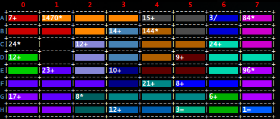

# Keen

uNouss

## Présentation de Keen

[]

Le Keen plus connu sous le nom de kendoku ou kenken est un jeu de mathématique dérivé du suduku créé par le Japonais Tetsuya Miyamoto.

Le jeu consiste à compléter une grille par des chiffres en les trouvant par déduction ou par calcul.

La grille est constitée d'un nombre égal de lignes et de colonnes contenant des blocs. Chaque bloc (ientifié par une couleur) peut contenir entre 1 et 5 cases pour cette variantes et peut avoir des formes variées.

Le chiffre inscrit en haut à gauche de chaque bloc est le résultat de l'opération (addition, soustraction, multiplication, division), située juste à côté de ce chiffre, effectuée avec les chiffres des cases d'un même bloc.

Comme pour le suduku, le but du jeu est de remplir toutes les cases de la grille avec des chiffres allant de 1 à la taille de la grille comprise sans jamais avoir deux fois le même chiffre dans la même colonne ou sur la même ligne.

L'intérêt pédagogique répose sur l'apprentissage des calculs arithmétiques simples et parfois qui nécessite quelques astuces de calculs. Cela peut permettre de réviser les règles de calculs.

Les fonctionnalités proposées reste limités dans cette version, le seul paramétrage possible est le choix de la taille.

## Utilisation de Keen

Au lancement du jeu, il suffit de lancer depuis un terminal (de préference xterm/konsole) des commandes suivantes:

`./compile.sh` <kbd>RET</kbd> permet de lancer la compilation des fichiers présents dans **src** et création des fichiers **.class** dans **classes**

`./run.sh Keen` <kbd>RET</kbd> permet de lancer le jeu

Votre objectif est de remplir la grille aléatoire dont vous aurez choisi la taille en tre 3 et 9 grâce aux indices présents sur les blocs.
Plus la taille est grande, le remplissage de la grille devient complexe.

Vous devez séléctionner une case sur la quelle placer le chiffre de votre choix; ce chiffre doit être compris entre 1 et la taille de la grille.

Pour jouer à une case donnée, il suffit de selectionner une ligne par sa lettre et une colonne par son chiffre, suivi de `:` et du chiffre à mettre dans la case.
Par exemple `A0:4` aura pour effet de placer à la ligne `A` et le colonne `0` le chiffre `4`.

Le jeu se termine quand vous avez correctement remplis la grille.

Un compteur permet de dire combien de temps vous avez mis pour remplir la grille.

## Exemples de parties

