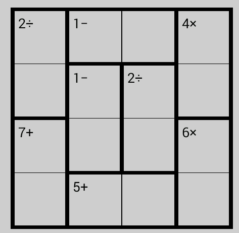
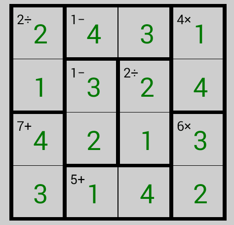
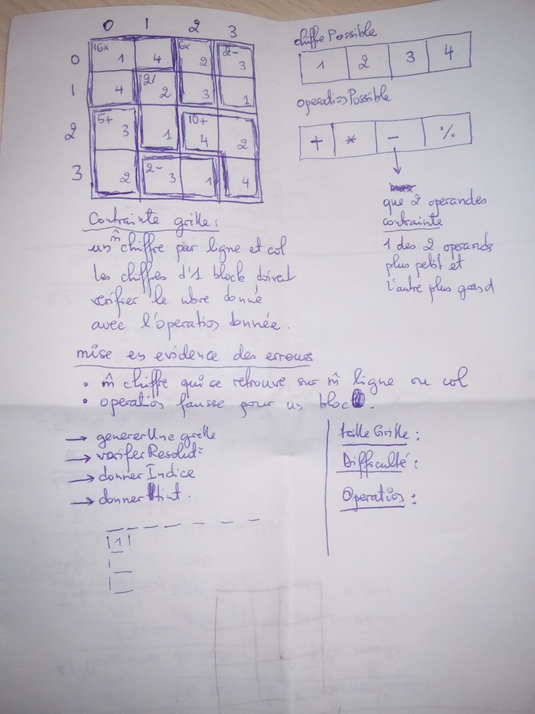

# État de l'art en projet 
1. __Inspiration__

  Le projet que nous souhaitons réaliser est un jeu de grille inspiré du _Suduku_ et du _Solo_. Il est connu sous le nom de **keen**. C'est un jeu que nous avons découvert grâce à l'application [Puzzles](https://github.com/chrisboyle/sgtpuzzles).

  Nous avons choisi ce jeu car en plus d'être ludique, il est également utile pour apprendre les calculs arithmétique avec des opérations simples. Nous avons donc estimé qu'il serait donc intéressant pour des élèves de primaire pour apprendre et consolider leurs pratiques des calculs. 

  Le jeu en question est un puzzle composé d'un grille carrée contenant des cases. Dans chaque case, nous avons des chiffres qui vont de 1 à la taille de la grille sur une dimension. La grille est divisé en bloc comme sur les captures. Ces blocs peuvent être de formes et de tailles différentes. Dans chaque bloc nous avons un nombre prérempli suivi d'une opération. Une des règles du jeu consiste, alors, à faire en sorte que les chiffres contenus dans le bloc puisse vérifier en utilisant l'opération arithmétique le nombre présent.

  L'objectif est donc de remplir la grille avec les chiffres comme ceci:
- chaque ligne contient seulement une occurence de chaque chiffre.
- chaque colonne contient seulement une occurence de chaque chiffre.
- En combinant les chiffres présents dans un bloc grâce à l'opération, on doit trouver le nombre indice présent dans le bloc:
  * un indice _d'addition_ (exemple `15+`) signifie que la somme des chiffres du bloc doivent être égale au nombre donné: Par exemple si dans un bloc j'ai comme indice `15+`, alors la somme des chiffres du bloc doit faire exactement `15`
  * un indice _de multiplication_ (exemple `60x`) signifie que le produit(`x`) des chiffres que vous avez saisi pour le bloc fait exactement `60` 
  * 
  * 

2. __description initiale__
  

  L'idée de départ consiste à faire un _Keen_ avec un niveau de difficulté en terme de jouabilité et de conception plus facile. C'est-à-dire de faire des blocs simples et homogène avec des opérations simples à faire comme la multiplication. 

1. 

